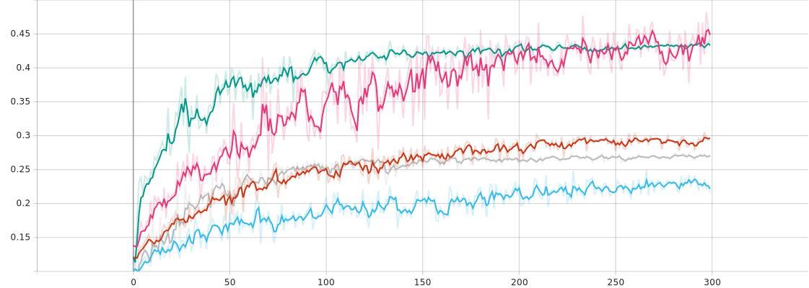

# NYCU Computer Vision 2025 Spring HW3

Author: 黃皓君  
Student ID: 111550034

## Introduction

This assignment addresses **multi-class cell instance segmentation** using a Mask R-CNN model (`maskrcnn_resnet50_fpn_v2`). Two training strategies were explored:

- **Unified Multi-Class Training**: A single Mask R-CNN trained to predict all four semantic classes at once.
- **Class-wise Training + Ensemble**: One Mask R-CNN model per class, trained independently. Predictions from each model were later combined using **cross-class Non-Maximum Suppression (NMS)** to resolve overlaps.

The objective was to assess whether isolating semantic classes into separate training tasks could improve precision, reduce label confusion, and yield a stronger ensemble model.

## How to Run

> **Note**: Code requires PyTorch ≥ 2.0, `torchvision`, `tqdm`, `scikit-image`, and `pycocotools`.

### 1. Unified Multi-Class Training and Submission

Run:
```bash
python train.py
```

This script performs the following:
- Trains a Mask R-CNN on all four classes simultaneously.
- Evaluates AP50 during training and saves the best-performing model (`best_model.pth`).
- Performs inference using the best model.
- Exports `test-results.json` and packages it into `submission.zip`.

### 2. Class-wise Ensemble Inference

Run:
```bash
python combine.py
```

This script assumes you've trained and saved four models:
- `class1_model.pth`, `class2_model.pth`, ..., `class4_model.pth`

It performs:
- Per-class inference using each respective model.
- Score filtering and category assignment.
- Cross-class NMS with an IoU threshold of 0.5.
- JSON export + ZIP packaging for Codabench submission.

## Performance Snapshot

| Method              | mAP50 (%) | Notes                                 |
|---------------------|-----------|----------------------------------------|
| Unified model       | 31.67     | Trained on all four classes together   |
| Class-wise ensemble | 32.51     | Combined predictions + cross-class NMS |

### Chart
  
*Color: Baseline – orange, class-1 – blue, class-2 – pink, class-3 – green, class-4 – gray*

**Conclusion**: The class-wise training strategy yields a **2.65%** improvement over the baseline, demonstrating that semantic isolation and proper ensembling can enhance detection precision in multi-instance scenarios.
